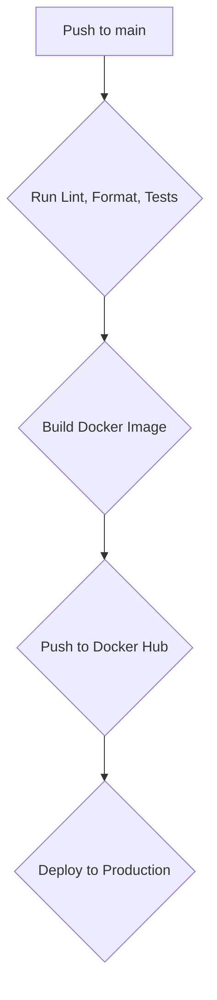

# Use Next Ship

A production-ready Next.js 15+ boilerplate with complete CI/CD pipeline for Kubernetes deployments. Built with TypeScript, BetterAuth.js, Drizzle ORM, and includes reproducible development environments using Nix/devenv.

## Overview

Use Next Ship is a batteries-included template that combines modern web development practices with enterprise-grade DevOps workflows. It provides everything you need to build, test, and deploy scalable Next.js applications with confidence - from local development with consistent environments to production deployments on Kubernetes.

### What This Project Uses

**DevOps & Infrastructure:**

- **Reproducible Development**: Using Nix and devenv for consistent development environments
- **Containerization**: Optimized Docker build
- **Kubernetes Deployment**: Helm charts with environment-specific configurations
- **Secrets Management**: SOPS for encrypted secrets in version control
- **CI/CD Pipeline**: GitHub Actions with reusable workflows
- **AI Development Tools**: Claude Code integrated into the development environment

**Application Stack:**

- **Framework**: Next.js 15+ with App Router and React 19
- **Type Safety**: TypeScript with strict mode, Zod validation
- **Database**: PostgreSQL with Drizzle ORM (type-safe queries)
- **Authentication**: BetterAuth.js with organizations support
- **Styling**: Tailwind CSS v4 with PostCSS
- **Testing**: Vitest with transaction rollbacks for fast database tests
- **Code Quality**: Biome for linting/formatting, Lefthook for git hooks
- **Session Storage**: Redis for caching and rate limiting (optional)

## Table of Contents

- [Architecture](#architecture)
- [Prerequisites](#prerequisites)
- [Local Development Setup](#local-development-setup)
- [Running the Application](#running-the-application)
- [Project Structure](#project-structure)
- [Database Schema](#database-schema)
- [Authentication](#authentication)
- [API Documentation](#api-documentation)
- [AI Development Tools](#ai-development-tools)
- [Development Commands](#development-commands)
- [Testing](#testing)
- [CI/CD Pipeline](#cicd-pipeline)
- [Deployment](#deployment)
- [Secrets Management](#secrets-management)
- [Using as a Template](#using-as-a-template)
- [GitHub Secrets Configuration](#github-secrets-configuration)
- [Environment Variables](#environment-variables)
- [Troubleshooting](#troubleshooting)
- [Documentation](#documentation)
- [Next Steps](#next-steps)

## Architecture

### High-Level Architecture

```text
┌─────────────────────────────────────────────────────────┐
│                     Frontend (Next.js)                   │
│  ┌─────────────────────────────────────────────────┐    │
│  │  App Router  │  React Components  │  Tailwind  │    │
│  └─────────────────────────────────────────────────┘    │
└─────────────────────────────────────────────────────────┘
                              │
                              ↓
┌─────────────────────────────────────────────────────────┐
│                    API Layer                             │
│  ┌─────────────────────────────────────────────────┐    │
│  │  API Routes  │  BetterAuth  │  Middleware       │    │
│  └─────────────────────────────────────────────────┘    │
└─────────────────────────────────────────────────────────┘
                              │
                              ↓
┌─────────────────────────────────────────────────────────┐
│                    Data Layer                            │
│  ┌─────────────────────────────────────────────────┐    │
│  │  Drizzle ORM  │  PostgreSQL  │  Redis (opt)     │    │
│  └─────────────────────────────────────────────────┘    │
└─────────────────────────────────────────────────────────┘
```

### Deployment Architecture

```text
GitHub → CI/CD → Docker Hub → Kubernetes Cluster
         ↓
      SOPS Decryption
         ↓
      Helm Deployment
```

## Prerequisites

Before you begin, you'll need to install several tools to work with this project effectively.

### 1. Install Nix

First, you need to install Nix, a powerful package manager that ensures reproducible development environments.

**For macOS users** (and others who want the best experience), I strongly recommend using the [Determinate Systems Nix installer](https://github.com/DeterminateSystems/nix-installer):

```bash
curl --proto '=https' --tlsv1.2 -sSf -L https://install.determinate.systems/nix | sh -s -- install --determinate
```

This installer provides better defaults and improved user experience compared to the official installer. For more details, visit: <https://docs.determinate.systems/determinate-nix/>

**If you want**, you can use the official installer (but you'll probably need to manually enable nix flakes):

```bash
sh <(curl -L https://nixos.org/nix/install) --daemon
```

After installation, restart your terminal or source your shell profile.

### 2. Install devenv

[devenv](https://devenv.sh) is a tool that creates reproducible development environments using Nix. Install it with:

```bash
nix profile install nixpkgs#devenv
```

### 3. Install direnv

[direnv](https://direnv.net/) automatically loads environment variables when you enter a directory. This integrates perfectly with devenv.

**On macOS:**

```bash
brew install direnv
```

**Or via nix:**

```bash
nix profile install nixpkgs#direnv
```

**Shell Integration:**
Add the following to your shell configuration file (`~/.bashrc`, `~/.zshrc`, etc.):

```bash
eval "$(direnv hook bash)"  # for bash
eval "$(direnv hook zsh)"   # for zsh
```

Restart your terminal after adding the hook.

### 4. Install Nix LSP

For an improved development experience with Nix files, install the Nix Language Server Protocol (LSP):

```bash
nix profile install nixpkgs#nil
```

## Local Development Setup

1. **Clone the repository:**

   ```bash
   git clone https://github.com/danilomartinelli/use-next-ship.git
   cd use-next-ship
   ```

2. **Allow direnv to manage the environment:**

   ```bash
   direnv allow
   ```

   This command tells direnv that you trust this directory to automatically load environment variables. You'll be prompted to do this the first time you enter the directory. This is a security feature and you should always inspect a repo that you've cloned before running this command.

3. **Enter the development shell:**
   Once direnv is allowed, it will automatically activate the devenv shell whenever you're in the project directory. You'll see output indicating you're in the development environment with all necessary tools available.

4. **Configure environment variables:**
   Copy the example environment file and fill in the required values:

   ```bash
   cp env.example .env
   ```

   Open `.env` in your editor and fill in the necessary configuration values. The example file contains all the environment variables needed for local development with sensible defaults. You'll need to set values for:

   - Database connection settings (default should work already with devenv's postgres)

   - BetterAuth secret and configuration

   - BETTER_AUTH_URL is required for deployments on platforms other than Vercel. See <https://authjs.dev/getting-started/deployment> for more info.

   - Any API keys or external service configurations

   **Note:** The `.env` file is automatically loaded by direnv when you're in the project directory.

## Running the Application

### Start All Services

To bring up all required services (PostgreSQL, Next.js dev server, etc.) in the background:

```bash
devenv up
```

This command starts all the services defined in `devenv.nix` using [process-compose](https://github.com/F1bonacc1/process-compose). The services will run in the background and restart automatically if they crash.

### Set Up the Database

Initialize the database with the required schema:

```bash
pnpm db:push
```

### Access the Application

Visit <http://localhost:3000> in your browser to see your Next.js application running!

## Project Structure

```text
use-next-ship/
├── src/                      # Source code
│   ├── app/                  # Next.js App Router
│   │   ├── api/             # API routes
│   │   │   └── auth/        # Authentication endpoints
│   │   ├── healthz/         # Health check endpoint
│   │   ├── layout.tsx       # Root layout
│   │   └── page.tsx         # Home page
│   ├── lib/                 # Shared utilities
│   │   └── auth-client.ts   # Auth client configuration
│   ├── server/              # Server-side code
│   │   ├── auth/           # Authentication setup
│   │   └── db/             # Database configuration
│   │       ├── schema.ts   # Database schema
│   │       ├── index.ts    # Database connection
│   │       └── test-db.ts  # Test database setup
│   └── env.js              # Environment validation
├── chart/                   # Helm charts
│   ├── templates/          # Kubernetes manifests
│   └── values/             # Environment configs
├── scripts/                # Utility scripts
├── drizzle/               # Database migrations
├── .github/               # GitHub Actions workflows
├── devenv.nix             # Development environment
└── package.json           # Dependencies
```

### File Organization Patterns

- **Features by Domain**: Code organized by feature domains
- **Colocation**: Related files kept together
- **Type Definitions**: Centralized in schema files
- **Configuration**: Environment-specific configs in dedicated directories

### Key Technologies

- **Next.js 15+** - React framework with App Router
- **TypeScript** - Type safety throughout the stack
- **Drizzle ORM** - Type-safe database ORM with PostgreSQL
- **PostgreSQL** - Database (configured via devenv)
- **BetterAuth.js** - Authentication framework
- **Tailwind CSS** - Utility-first CSS framework
- **Vitest** - Fast unit testing framework
- **Docker** - Containerization
- **Kubernetes + Helm** - Orchestration and deployment
- **GitHub Actions** - CI/CD pipeline

## Database Schema

### User Tables

```typescript
// User: Core user information
user {
  id: text (PK)
  name: text
  email: text (unique)
  emailVerified: boolean
  image: text?
  createdAt: timestamp
  updatedAt: timestamp
}

// Session: Active user sessions
session {
  id: text (PK)
  userId: text (FK → user.id)
  token: text (unique)
  expiresAt: timestamp
  activeOrganizationId: text?
  ipAddress: text?
  userAgent: text?
}
```

### Organization Tables

```typescript
// Organization: Team/company entities
organization {
  id: text (PK)
  name: text
  slug: text (unique)
  logo: text?
  metadata: text?
}

// Member: User-organization relationships
member {
  id: text (PK)
  organizationId: text (FK → organization.id)
  userId: text (FK → user.id)
  role: text (default: "member")
}

// Invitation: Pending organization invites
invitation {
  id: text (PK)
  organizationId: text (FK → organization.id)
  email: text
  role: text?
  status: text (default: "pending")
  expiresAt: timestamp
  inviterId: text (FK → user.id)
}
```

### Authentication Tables

```typescript
// Account: Authentication providers
account {
  id: text (PK)
  userId: text (FK → user.id)
  providerId: text
  accountId: text
  password: text?
  // OAuth tokens
  accessToken, refreshToken, idToken
}

// Verification: Email/token verification
verification {
  id: text (PK)
  identifier: text
  value: text
  expiresAt: timestamp
}
```

## Authentication

### Setup

Authentication is configured in `src/server/auth/index.ts`:

- Drizzle adapter for database persistence
- Email/password authentication enabled
- Organization plugin for team management
- Environment-aware base URL configuration

### Client Integration

The auth client (`src/lib/auth-client.ts`) provides:

- Session management hooks
- Authentication utilities
- Type-safe user context

### API Routes

Authentication endpoints at `/api/auth/[...all]`:

- Sign up/Sign in
- Session management
- Password reset
- Organization management

## API Documentation

### Health Check Endpoint

**GET** `/healthz`

- **Purpose**: Kubernetes liveness/readiness probe
- **Response**: `200 OK` with JSON `{ status: "ok" }`

### Authentication Endpoints

**Base Path**: `/api/auth`

| Endpoint | Method | Purpose |
|----------|--------|---------|
| `/signup` | POST | User registration |
| `/signin` | POST | User login |
| `/signout` | POST | End session |
| `/session` | GET | Current session info |
| `/forgot-password` | POST | Password reset request |
| `/reset-password` | POST | Complete password reset |

### Organization Endpoints

| Endpoint | Method | Purpose |
|----------|--------|---------|
| `/organization/create` | POST | Create organization |
| `/organization/invite` | POST | Invite member |
| `/organization/members` | GET | List members |
| `/organization/update` | PUT | Update organization |

## AI Development Tools

This project comes pre-configured with Claude Code development tool that is automatically installed via the devenv setup. This may be particularly useful for developers who may not have Node.js/npm/pnpm installed on their machines globally.

### Available AI Agents

The following AI development tools are automatically installed when you enter the devenv shell:

- **Claude Code** (`@anthropic-ai/claude-code`) - Anthropic's official CLI for Claude AI assistance

### How It Works

When you run `direnv allow` and enter the development environment, devenv automatically:

1. **Installs Node.js and pnpm** - Exact versions pinned in devenv.nix
2. **Installs AI development tools** - All configured via the package.json and devenv setup
3. **Makes tools available** - AI agents are accessible directly from your terminal

### Using the AI Tools

Once your development environment is active, you can use these tools directly:

```bash
# Use Claude Code for development assistance
claude --help
```

### Benefits for Web Developers

- **Consistent environment** - Same tools and versions for all team members
- **Zero global pollution** - Tools are scoped to the project environment
- **Zero configuration** - Tools are ready to use immediately
- **Reproducible** - Exact versions pinned in configuration

## Development Commands

This project uses `pnpm` for dependency management and includes several useful development commands:

### Dependency Management

```bash
# Install all dependencies
pnpm install

# Add a new dependency
pnpm add <package>

# Add a development dependency
pnpm add -D <package>

# Update dependencies
pnpm upgrade
```

### Next.js Commands

```bash
# Run the development server with Turbo
pnpm dev

# Build for production
pnpm build

# Start production server
pnpm start
```

### Database Commands

```bash
# Push schema changes to database
pnpm db:push

# Generate migrations
pnpm db:generate

# Run migrations
pnpm db:migrate

# Open Drizzle Studio (database GUI)
pnpm db:studio
```

### Code Quality Commands

```bash
# Run Biome linting
pnpm lint

# Format check and write
pnpm format

# Type check
pnpm typecheck

# Run both lint and typecheck
pnpm check
```

### Docker Commands

```bash
# Build Docker image
make SHORT_SHA=<commit-sha> build-docker-image
```

### Deployment Commands

```bash
# Deploy to Kubernetes
make IMAGE_TAG=<tag> ENVIRONMENT=<env> NAMESPACE=<ns> KUBECONFIG=<config> deploy

# Example production deployment
make IMAGE_TAG=v1.0.0 ENVIRONMENT=prod NAMESPACE=hellok8s KUBECONFIG=~/.kube/config deploy
```

**NOTE**: I make it a point in all projects to enable developers to run commands locally that the CI invokes. This is very useful when fires arise.

## Testing

Run the test suite using Vitest:

```bash
# Run all tests
pnpm test

# Run tests with UI
pnpm test:ui

# Run tests in watch mode
pnpm test --watch

# Set up test database
pnpm test:setup

# Tear down test database
pnpm test:teardown
```

### Fast Test Performance

This project uses **transaction rollbacks** and **MD5 hashing** for database tests, providing:

- **Speed**: Tests run against the real PostgreSQL database but rolls back all changes between tests
- **Fast Hashing**: MD5 is used for password hashing in tests (NOT production) for speed
- **Isolation**: Each test runs in a clean state without affecting other tests
- **Real Database**: Uses PostgreSQL instead of mocking, catching real database behavior

The test setup automatically wraps each test in a transaction that gets rolled back, ensuring tests are both fast and reliable.

### Test Structure

Tests are organized alongside the source code:

- `src/app/**/*.test.ts` - Page and API route tests
- `src/lib/**/*.test.ts` - Utility and library tests
- `src/server/**/*.test.ts` - Server-side logic tests

## CI/CD Pipeline

This project uses GitHub Actions with a reusable workflow architecture that supports deploying to multiple environments (staging, production, etc.).

### CI/CD Overview

This diagram illustrates the CI/CD pipeline for the use-next-ship project:



### How It Works

1. **Triggering Builds:**

   - Every push to `main` triggers the CI pipeline
   - On an actual **private** production repo we'd want pull requests to run tests and build validation. This is disabled here since this is a public example repo (see .github/workflows/cicd.yml) which warrants special considerations.
   - Triggers production deployments

2. **Docker Image Building:**
   The application is packaged into a Docker container using Node.js and pnpm for fast, reproducible builds:

   ```dockerfile
   FROM node:22-alpine
   # ... optimized Next.js build process
   ```

3. **Reusable Workflow:**
   The `.github/workflows/` directory contains reusable workflow templates that can be called from different environments:

   ```yaml
   # Example: Deploy to prod
   jobs:
     deploy:
       uses: ./.github/workflows/deploy.yml
       with:
         environment: prod
         namespace: hellok8s
   ```

## Deployment

### Docker Build

The application uses a multi-stage Docker build:

1. **Dependencies**: Install production dependencies
2. **Build**: Compile Next.js application
3. **Runtime**: Minimal production image

### Helm Chart Structure

The Kubernetes deployment uses Helm for templating and configuration management:

```text
chart/
├── Chart.yaml          # Chart metadata
├── values.yaml         # Default values
├── templates/
│   ├── deployment.yaml # Next.js app deployment
│   ├── service.yaml    # Kubernetes service
│   ├── ingress.yaml    # Ingress configuration
    ...
└── values/
    └── prod.yaml # Production-specific values
    └── secrets.yaml # Production-specific sops encrypted secrets
```

### Deployment Process

1. **GitHub Actions builds and pushes Docker image to Docker Hub**
2. **Helm chart is deployed to Kubernetes cluster**
3. **SOPS decrypts environment-specific secrets during deployment**
4. **Rolling deployment ensures zero-downtime updates**

The deployment command looks like:

```bash
make IMAGE_TAG=sha-123 ENVIRONMENT=prod NAMESPACE=hellok8s KUBECONFIG=/path/to/kubeconfig.yaml deploy
```

### Environment Management

- **Development**: Local devenv with PostgreSQL
- **Staging**: Kubernetes namespace with test data
- **Production**: Kubernetes with production secrets

## Secrets Management

This project uses [SOPS](https://github.com/mozilla/sops) for managing encrypted secrets in the repository.

### How SOPS Works Here

1. **Environment Variables:** Database passwords, API keys, and other secrets are stored encrypted in `chart/values/<env>/secrets.yaml`
2. **Encryption:** We use **age** encryption (though AWS KMS and others are also supported)
3. **CI/CD Integration:** GitHub Actions runners decrypt secrets during deployment using the private age key
4. **Runtime:** Secrets are injected into Kubernetes pods as environment variables

### SOPS Configuration

The `.sops.yaml` file defines encryption rules:

```yaml
creation_rules:
  - path_regex: \.yaml$
    age: age1... # public age key
```

### Alternative: AWS KMS

For production systems, consider using AWS KMS (or similar) instead of age keys. See the [SOPS documentation](https://github.com/getsops/sops?tab=readme-ov-file#using-sops-yaml-conf-to-select-kms-pgp-and-age-for-new-files) for configuration details.

## Using as a Template

Want to use this project as a starting point for your own Next.js application? Here's how:

### 1. Clone and Reset Git History

```bash
# Clone the repository
git clone https://github.com/danilomartinelli/use-next-ship.git my-new-project
cd my-new-project

# Remove the existing git history
rm -rf .git

# Initialize a new git repository
git init
git add .
git commit -m "Initial commit from use-next-ship template"

# Add your own remote origin
git remote add origin https://github.com/yourusername/my-new-project.git
git push -u origin main
```

### 2. Customize the Project

- Update `package.json` with your project name and details
- Modify Next.js configuration in `next.config.js`
- Update the Helm chart in `chart/` with your application name
- Customize the README.md for your project

### 3. Set Up Your Development Environment

Follow the [Local Development Setup](#local-development-setup) instructions above.

### Common Customization Tasks

**Add a new database table**:

1. Define schema in `src/server/db/schema.ts`
2. Run `pnpm db:generate` for migration
3. Run `pnpm db:push` to apply

**Add authentication provider**:

1. Configure in `src/server/auth/index.ts`
2. Update environment variables
3. Test with `pnpm dev`

**Deploy to production**:

1. Push to main branch
2. CI/CD builds and tests
3. Docker image pushed to registry
4. Helm deploys to Kubernetes

## GitHub Secrets Configuration

To enable the CI/CD pipeline, you need to configure several secrets in your GitHub repository.

### Repository Secrets

These secrets are available to all environments and workflows:

1. **`DOCKERHUB_USERNAME`** - Your Docker Hub username

   ```text
   example: johndoe
   ```

2. **`DOCKERHUB_TOKEN`** - Your Docker Hub access token

   ```text
   Generate at: https://hub.docker.com/settings/security
   ```

3. **`AGE_KEY_FILE`** - Private age key for SOPS decryption

   **Generate an age key:**

   ```bash
   # Install age if you haven't already
   nix profile install nixpkgs#age

   # Generate a new key pair
   age-keygen -o age-key.txt

   # Copy the ENTIRE contents of age-key.txt as the secret value
   cat age-key.txt

   # You can also use the gh cli to this more effectively
   # add --env prod for setting a secret in an environment like prod/staging/etc
   cat age-key.txt | gh secret set AGE_KEY_FILE --app actions --repo yourusername/yourrepo
   ```

   **Alternative: AWS KMS**
   Instead of age keys, you can use AWS KMS for encryption. See the [SOPS documentation](https://github.com/getsops/sops?tab=readme-ov-file#using-sops-yaml-conf-to-select-kms-pgp-and-age-for-new-files) for setup instructions.

### Environment Secrets

Create a **production** environment in your repository settings, then add:

1. **`KUBECONFIG_YAML`** - Your Kubernetes cluster configuration

   **⚠️ Important:** This should be an **Environment Secret**, not a Repository Secret, for better security isolation and since you'll likely have a separate staging cluster with different credentials.

   ```bash
   # Get your kubeconfig content
   cat ~/.kube/my-k8s-config-limited-to-this-namespace.yaml

   # Copy the entire YAML content as the secret value
   # TODO: publish terraform module for creating these
   ```

### Setting Up Secrets in GitHub

1. Go to your repository on GitHub
2. Click **Settings** → **Secrets and variables** → **Actions**
3. Add the three repository secrets listed above
4. Click **Environments** → **New environment** → Name it "prod"
5. Add the `KUBECONFIG_YAML` secret to the production environment

### Alternative Container Registries

If you prefer to use AWS ECR, Google Container Registry, or another registry instead of Docker Hub:

1. Replace `DOCKERHUB_USERNAME` and `DOCKERHUB_TOKEN` with appropriate credentials
2. Update the Docker registry configuration in `.github/workflows/build.yml` files (there's a commented out example for AWS ECR)
3. Update the Helm chart's image repository settings in `chart/values.yaml` (you'll also need to add imagePullSecrets since this will likely be a private registry).

## Environment Variables

### Required for Production

| Variable | Purpose |
|----------|---------|
| `BETTER_AUTH_SECRET` | Authentication encryption key |
| `DATABASE_URL` | PostgreSQL connection string |
| `NEXT_PUBLIC_BASE_URL` | Application URL |

### Optional

| Variable | Purpose |
|----------|---------|
| `BETTER_AUTH_URL` | Override auth URL (non-Vercel) |
| `REDIS_URL` | Redis for caching/rate limiting |

### Version Management

All software versions are pinned in `devenv.nix`:

- Node.js version
- PostgreSQL version
- Development tools

This ensures consistency across:

- Local development
- Docker builds
- CI/CD pipeline
- Production deployments

## Troubleshooting

### Common Issues and Solutions

#### Development Environment

**Problem: `direnv allow` doesn't work**

- Make sure you have direnv installed and the shell hook configured
- Check that you're in the project root directory
- Try running `direnv reload`

**Problem: Services won't start with `devenv up`**

- Check if PostgreSQL port (5432) is already in use: `lsof -i :5432`
- Ensure all dependencies are installed: `pnpm install`
- Check the devenv logs: `devenv up --verbose`

**Problem: Database connection errors**

- Verify PostgreSQL is running: `pg_isready -h localhost -p 5432`
- Check your `.env` file has correct database settings
- Try pushing the schema: `pnpm db:push`

#### Next.js Issues

**Problem: Build fails with type errors**

- Run type checking: `pnpm typecheck`
- Check for missing dependencies: `pnpm install`
- Verify TypeScript configuration in `tsconfig.json`

**Problem: API connection issues**

- Ensure the database is running and schema is up to date
- Check environment variables are loaded correctly
- Verify API routes are properly configured

#### Docker & Deployment

**Problem: Docker build fails**

- Ensure you have the correct Node.js version in your Dockerfile
- Check that all dependencies in `package.json` are available
- Verify your Docker daemon is running

**Problem: Kubernetes deployment fails**

- Check your kubeconfig is valid: `kubectl cluster-info`
- Verify secrets are properly encrypted with SOPS
- Check Helm chart syntax: `make IMAGE_TAG=foo NAMESPACE=hellok8s ENVIRONMENT=prod helm-lint`

#### SOPS & Secrets

**Problem: Cannot decrypt secrets**

- Verify your age private key is correctly set in GitHub secrets
- Check that the public key in `.sops.yaml` matches your private key
- Ensure you have the correct permissions to access the encrypted files

**Problem: Environment variables not loading**

- Make sure your `.env` file is in the project root
- Check that direnv is loading the environment: `direnv status`
- Verify environment variable names match Next.js requirements (NEXT*PUBLIC* prefix for client-side vars)

#### Authentication Errors

**Problem: Authentication not working**

- Verify `BETTER_AUTH_SECRET` is set
- Check `BETTER_AUTH_URL` for deployments
- Review session configuration

### Getting Help

If you encounter issues not covered here:

1. Check the [GitHub Issues](https://github.com/danilomartinelli/use-next-ship/issues) for similar problems
2. Review the devenv and Next.js logs for error messages
3. Ensure all prerequisites are correctly installed
4. Try recreating your development environment from scratch (see `make clean`)

### Useful Debug Commands

```bash
# print make commands
# (poor man's cli) :)
make help

# Check devenv status
devenv info

# Check Next.js build
pnpm build

# Run type checking
pnpm typecheck

# Check database connection
pnpm db:studio

# Validate Helm chart
make IMAGE_TAG=foo NAMESPACE=hellok8s ENVIRONMENT=prod helm-template

# Test SOPS decryption
sops -d chart/values/prod/secrets.yaml
```

---

## Documentation

For more detailed information about specific topics, please refer to our comprehensive documentation:

- **[Architecture Overview](docs/ARCHITECTURE.md)** - System design, component architecture, and technical decisions
- **[Deployment Guide](docs/DEPLOYMENT.md)** - Local development, Docker, Kubernetes, and platform deployments
- **[API Documentation](docs/API.md)** - API routes, authentication, validation, and best practices
- **[Troubleshooting Guide](docs/TROUBLESHOOTING.md)** - Common issues, solutions, and debugging tips
- **[Contributing Guidelines](docs/CONTRIBUTING.md)** - How to contribute, coding standards, and pull request process
- **[Security Best Practices](docs/SECURITY.md)** - Security guidelines, vulnerability management, and incident response

## Next Steps

The following features and improvements are planned for this template:

### Infrastructure & DevOps

- [ ] **Complete Helm Chart Configuration** - Finish the chart folder with production-ready Kubernetes manifests
- [ ] **Terraform Module** - Create a reusable Terraform module for infrastructure provisioning
- [ ] **Lefthook Git Hooks** - Integrate Lefthook as post-commit hooks in devenv.nix for automated quality checks
- [ ] **GitHub Actions Workflows** - Complete build and deploy workflows for staging/production environments
- [ ] **Container Registry Setup** - Add support for AWS ECR, Google Container Registry

### Application Features

- [x] **tRPC Integration** - Add tRPC to the boilerplate for type-safe API development
- [ ] **Redis Integration** - Fully integrate Redis for caching, rate limiting, and session management
- [ ] **Multi-tenant Middleware** - Create middleware to manage tenants and multi-domain support
  - Subdomain-based tenant isolation
  - Custom domain mapping
  - Tenant-specific database schemas
  - Cross-tenant data isolation
- [ ] **BetterAuth Providers** - Add example OAuth providers (Google, GitHub, Discord)
- [ ] **Component Library** - Create starter components:
  - Authentication forms (login, register, forgot password)
  - Dashboard layout with navigation
  - Data tables with sorting/filtering
  - Form components with validation
  - Loading states and error boundaries
  - Toast notifications
- [ ] **API Rate Limiting** - Implement Redis-based rate limiting middleware
- [ ] **Email Service** - Add email templates and sending service (React Email + Resend/SendGrid)

### Testing & Quality

- [ ] **Comprehensive Test Suite** - Create starter tests with examples for:
  - Unit tests for utilities
  - Integration tests for API routes
  - E2E tests for critical user flows
  - Database transaction tests

### Documentation

- [x] **Documentation Hub** - Create comprehensive docs in the `docs/` folder:
  - Architecture decision records (ADRs)
  - API documentation
  - Deployment guides
  - Troubleshooting guides
  - Contributing guidelines
  - Security best practices

### Contributing

Want to help implement these features? Contributions are welcome! Please:

1. Check the [Issues](https://github.com/danilomartinelli/use-next-ship/issues) for existing discussions
2. Fork the repository and create a feature branch
3. Implement your feature following the existing code style
4. Add tests and documentation
5. Submit a pull request with a clear description

---

## License

This project is open source and available under the [BSD 3-Clause License](LICENSE).
